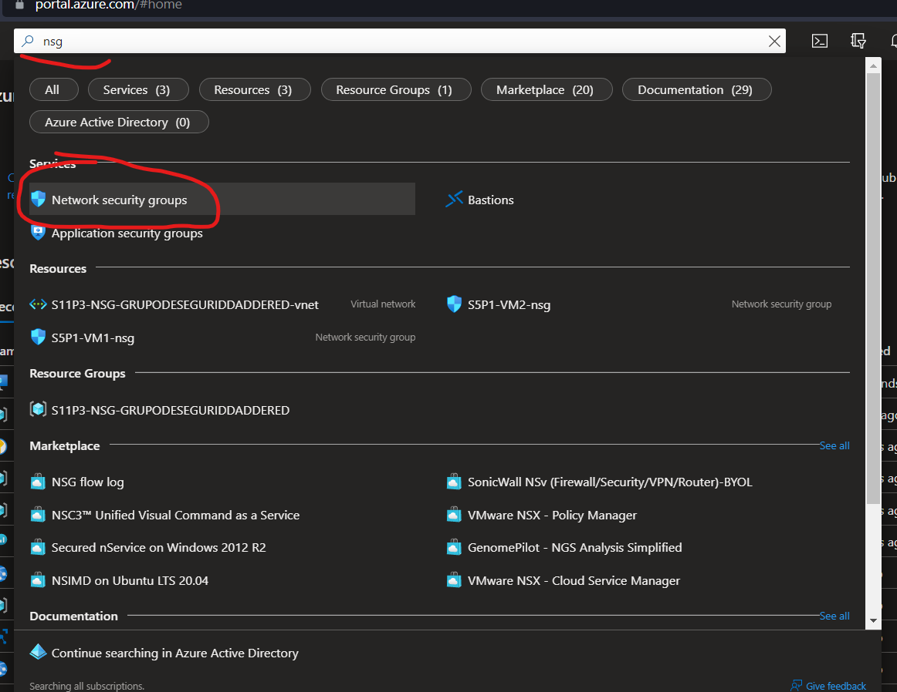
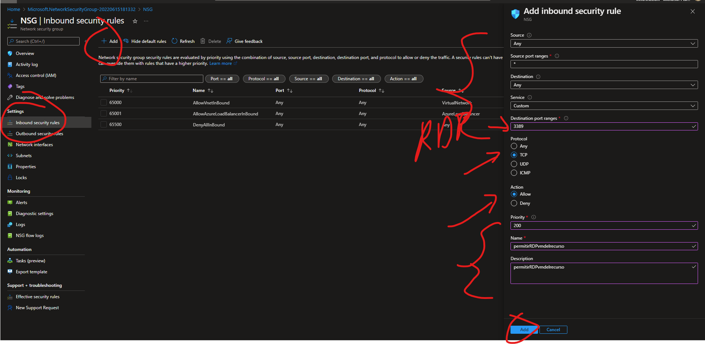
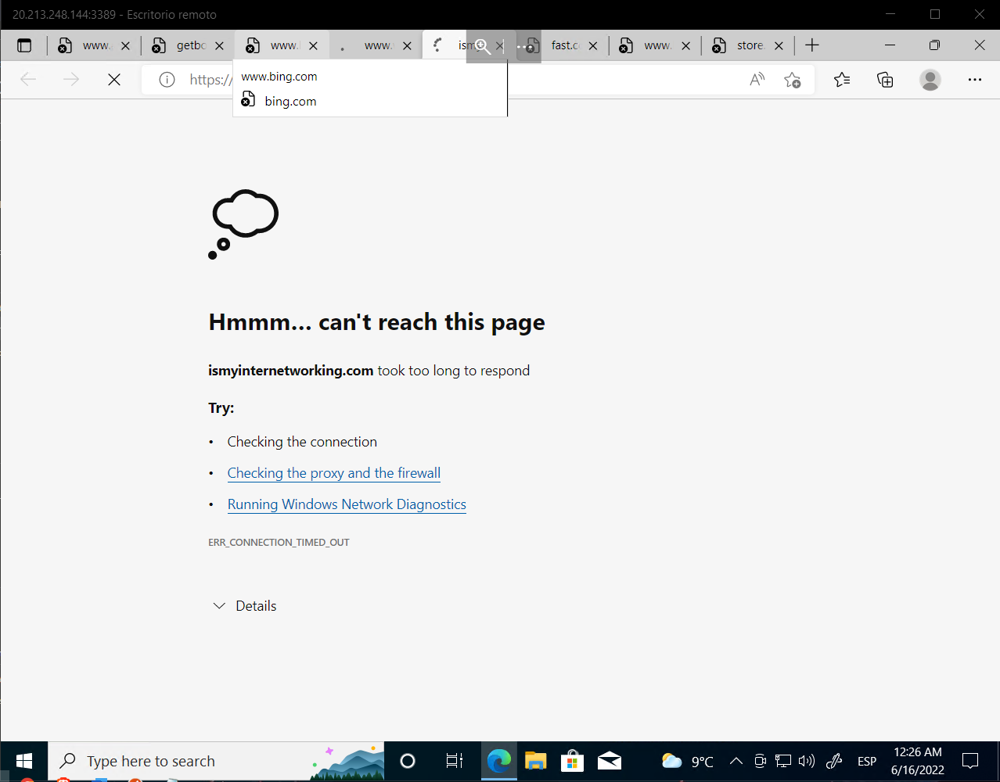

# AZURE - GRUPO DE SEGURIDAD DE RED
**En esta practica aprenderas a crear y utilizar el GRUPO DE SEGURIDAD DE RED en AZURE**

## Requisitos
- Tener una suscripcion en Azure
- Tener una conexion a internet
- Tener un navegador instalado (Brave,Google,Firefox, etc)
-------------------------
**1.-Primero creamos una VM desde el Portal de AZURE**

**2.-Le damos lo minimo para poder crearlo, (puedes seguir esta configuracion si la desea) es importante que le demos un nombre de Administrador y contraseña**

**3.-Nos vamos a networking y en "NIC network security group damos en none (aqui le denegamos cualquier tipo de  de puerto para entrar como por ejemplo RDP)**

**4.-Ahora nos vamos a Management y lo ponemos como esta aqui y le damos en Review y Create**

**5.-Ahora buscamos NSG en el portal de azure**

**6.-Le damos lo minimo para crearse como a continuacion y le damos en Revisar y crear y nos adentramos al recurso**

**7.-Ahora nos adentramos en la parte izquierda y le damos en Network interfaces, le damos en associate y le damos un nombre como a continuacion:**

**8.-Ahora nos vamos a nuestra maquina virtual vamos a Connect en RDP y descargamos el RDP**

**Aclaración.-Veras que a continuacion si nos intentamos conectar no nos dejará**

**9.-Ahora vamos a nuestro NSG y nos vamos a Inboud security rules le damos en add y a continuacion le damos lo sig: Source "Any", Source port ranges "*" (para que sea en todo), Destination"Any", Service "Custom", Destination port ranges "3389"(el puerto se saca en el punto num 8 donde nos fuimos a Connect viene el apartado de puerto), Protocol "TCP", Action "Allow" Priority"20", Name"Le damos cualquier nombre", Description "Cualquier descripcion". (Esto puede cambiar si requieres de otra configuracion, esto lo que va hacer es permitirle al usuario de la VM que use el puerto RDP) y le damos en add (¿y por que hacemos esto si cuando creamos una vm nos deja entrar normalmente?, bueno cuando creamos la VM la creamos para que no la deje entrar desde cualquier puerto y por eso tenemos que darle acceso desde un NSG)**

**10.-Vamos al archivo descargado RDP lo abrimos y ingresamos nuestras credenciales puestas a la hora de crear nuestra maquina virtual**

**11.-Abrimos Google como ejemplo y como puedes ver ahora podemos entrar al a VM sin problema y abrir google**

**12.-Volvemos a nuestro NSG vamos a outbound security rules (ahora denegemos el internet a la VM) le damos lo sig: (ahora en action damos deny) y damos en add**

**13.-Y como puedes ver no nos deja navegar en ningun sitio por el NSG**

